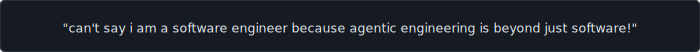

<table>
<tr>
  <td>
<pre>
┌──────────────────────────────────┐
│         N E K W A S A R           │
│    Agentic & Systems Engineer     │
└──────────────────────────────────┘
</pre>
  </td>
  <td valign="bottom">
<pre>
┌────────────┐
│ 0 visitors │
└────────────┘
</pre>
  </td>
</tr>
</table>

<br>

<p align="center">
  
</p>

<br>

<table>
<tr>
  <td width="50%" valign="top">
<pre>
┌─ stack ──────────────────────────┐
│                                   │
│  languages                        │
│  go  ·  typescript  ·  js        │
│  ruby  ·  ejs                     │
│                                   │
│  backend                          │
│  fastapi  ·  node.js  ·  nextjs   │
│                                   │
│  frontend                         │
│  react  ·  html  ·  css           │
│  tailwind  ·  shadcn  ·  jinja    │
│                                   │
│  databases                        │
│  mongodb (mongoose)               │
│  postgresql  ·  mysql             │
│                                   │
│  infrastructure                   │
│  nginx  ·  docker  ·  linux       │
│  (raw metal / empty server)       │
│                                   │
└───────────────────────────────────┘
</pre>
  </td>
  <td valign="top">
<pre>
┌─ about ──────────────────────────┐
│                                   │
│  Agentic & Solutions Architect    │
│  Fullstack Developer              │
│                                   │
│  Architecting the future of       │
│  autonomous software.             │
│                                   │
│  I love digging into new tech,    │
│  playing and testing out latest   │
│  tools, AI models, and mostly     │
│  freebies.                        │
│                                   │
│  🛠️ Research Nerd.                │
│  🤖 Agentic Workflow Builder.     │
│  🍜 Anime Enthusiast.             │
│                                   │
└───────────────────────────────────┘
</pre>
  </td>
</tr>
</table>

<sub><strong>note:</strong> the stack listed above are frameworks i have worked heavily with and gained serious experience from. no claim of syntax expertise.</sub>

<br>

```
┌─ projects ─────────────────────────────────────────────┐
│                                                          │
│  ▸ Creamy docs                                          │
│    AI toolkit for Document Maker, Formatter,             │
│    and Converter.                                        │
│                                                          │
│  ▸ YoTop10                                              │
│    Top 10 Lists Ranking Platform.                        │
│                                                          │
└──────────────────────────────────────────────────────────┘
```

<br>

```
┌─ highlight ─────────────────────────────────────────────┐
│                                                          │
│  I have been playing around with apps, mostly focused    │
│  on backend systems — I can say I am amongst the 1%      │
│  in this niche.                                          │
│                                                          │
│  2022  ▸  Codecademy on a laptop. Knew nothing.          │
│  2023  ▸  Intermediate dev, static projects              │
│           (mostly YouTube-inspired)                      │
│  2024  ▸  Expert in static — HTML, CSS, JS, EJS          │
│  2025  ▸  The main saga begins...                          │
│                                                          │
│  I have built a lot of apps, most unfinished or          │
│  slightly contributed to. The ones I did complete        │
│  got trashed once they felt boring...                      │
│                                                          │
│  Being broke was one of the biggest factors of my        │
│  breakthrough in this niche. I couldn't afford            │
│  high-end models, so I was forced to use very bad        │
│  ones — which taught me debugging                        │
│  and system architecture...                                 │
│                                                          │
│  → full story coming on                                  │
│    <a href="https://medium.com/@nekwasar">medium.com/@nekwasar</a>                         │
│                                                          │
└──────────────────────────────────────────────────────────┘
```

<br>

<p align="center">
  <a href="https://x.com/nekwasar">twitter</a>
  &nbsp;·&nbsp;
  <a href="https://linkedin.com/in/nekwasar">linkedin</a>
  &nbsp;·&nbsp;
  <a href="https://medium.com/@nekwasar">medium</a>
  &nbsp;·&nbsp;
  <a href="https://nekwasar.com">nekwasar.com</a>
</p>

